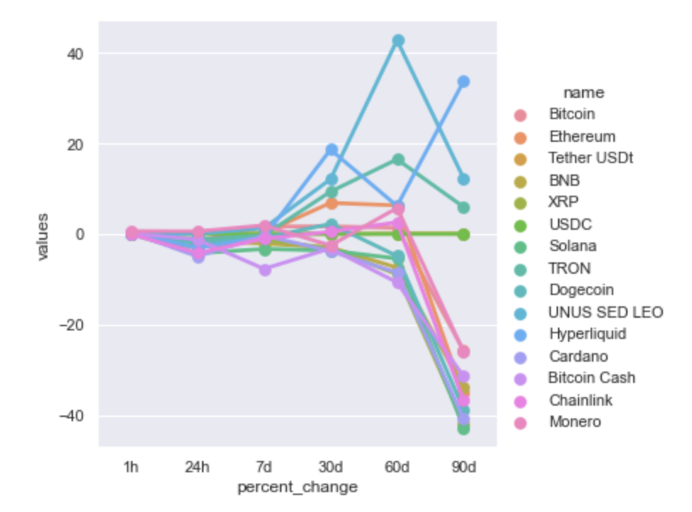

# 🔄 Automate API Extraction Project

This repository contains my Python project for extracting cryptocurrency market data from the **CoinMarketCap API**, storing the results over time, and analyzing percentage change trends using **Pandas**, **Seaborn**, and **Matplotlib**.

The project demonstrates how to automate API calls, normalize JSON data into a DataFrame, append repeated records, and visualize short-term and long-term performance across major cryptocurrencies.

---

## 📌 Introduction

This project uses Python to connect to the CoinMarketCap API and retrieve live cryptocurrency market data.

After extracting the data, I transformed the JSON response into a structured Pandas DataFrame, added timestamps for tracking, and prepared the data for analysis and visualization. The final output compares percentage changes across different time windows for the top cryptocurrencies.

This project focuses on:

- API data extraction
- JSON normalization
- automated repeated data collection
- timestamp tracking
- trend comparison across time periods
- cryptocurrency data visualization

---

## 💡 Motivation

Cryptocurrency prices change rapidly, making them a strong use case for automated data extraction and repeated monitoring.

The goal of this project is to build a workflow that can:

- pull market data automatically from an API
- collect repeated snapshots over time
- compare short-term and long-term performance across major cryptocurrencies
- visualize market movement in a simple and understandable way

This project shows how Python can be used to automate a real-world data pipeline for financial and market analysis.

---

## 📂 Dataset Description

The project uses live market data from the:

- **CoinMarketCap API**
- Endpoint: `v1/cryptocurrency/listings/latest`

The API request retrieves the top 15 cryptocurrencies with pricing and percentage change information in USD.

Key fields used in the project include:

- `name`
- `quote.USD.price`
- `quote.USD.percent_change_1h`
- `quote.USD.percent_change_24h`
- `quote.USD.percent_change_7d`
- `quote.USD.percent_change_30d`
- `quote.USD.percent_change_60d`
- `quote.USD.percent_change_90d`
- `timestamp`

These fields are used to compare market performance across multiple time horizons.

---

## 🧪 Tools and Libraries Used

This project was built using:

- **Python**
- **Requests**
- **JSON**
- **Pandas**
- **Seaborn**
- **Matplotlib**
- **OS / Time / Sleep** for automation workflow

These tools support API extraction, file handling, data transformation, and visualization.

---

## ⚙️ Project Workflow

### 1. Connect to the API

The notebook begins by creating a request session and calling the CoinMarketCap API to retrieve the latest cryptocurrency listings.

Main steps:
- define the endpoint URL
- set request parameters
- authenticate with API headers
- fetch and parse the JSON response

### 2. Normalize JSON data

The API response is converted into a structured DataFrame using Pandas so the nested JSON becomes easier to analyze in tabular form.

### 3. Add extraction timestamp

A timestamp column is added to record when each API call was made. This makes it possible to track repeated snapshots over time.

### 4. Automate repeated extraction

The project defines an `api_runner()` function and runs it repeatedly inside a loop with a delay between calls.

This allows the workflow to:
- refresh data automatically
- append new records to the dataset
- create a simple historical log of market snapshots

### 5. Save and reload extracted data

The collected API data is stored in a CSV file and later reloaded for further analysis.

### 6. Group percentage changes by cryptocurrency

The notebook groups the data by coin name and calculates average percentage changes across these time periods:

- 1 hour
- 24 hours
- 7 days
- 30 days
- 60 days
- 90 days

### 7. Reshape the data for plotting

The grouped results are stacked, converted into a DataFrame, reset into columns, and renamed so they can be used more easily in Seaborn.

### 8. Build visualizations

The project creates:
- a comparison plot of percentage changes across multiple time windows for different cryptocurrencies
- a time-based Bitcoin price trend plot using extracted timestamps

---

## 📊 Key Visualisation

### Percentage Change Comparison Across Cryptocurrencies



This visualization compares average percentage changes across multiple time windows for the top 15 cryptocurrencies. It shows how performance varies across short-term and long-term periods.

Some cryptocurrencies show strong gains over 30- to 60-day periods, while several coins decline sharply over the 90-day period. This makes the chart useful for comparing momentum, volatility, and relative market performance across major coins.

---

## 📈 Main Insights

From the analysis, several useful patterns can be observed:

- different cryptocurrencies show very different performance across 1-hour, 24-hour, 7-day, and longer-term windows
- some coins experience strong gains over medium-term periods such as 30 or 60 days
- several coins show sharp declines over the 90-day period
- timestamped API extraction allows prices to be tracked over time
- reshaping the data with Pandas makes it easier to compare many cryptocurrencies in one visual

Overall, the project demonstrates how automated API extraction can be used to build a simple cryptocurrency monitoring and trend-analysis workflow.

---

## 🛠️ Techniques Used

This project demonstrates the use of:

- API requests with `requests`
- JSON parsing
- `pd.json_normalize()`
- timestamp creation with `pd.to_datetime()`
- repeated execution with loops and `sleep()`
- CSV export and import
- `groupby()`
- `mean()`
- `stack()`
- `to_frame()`
- `reset_index()`
- `rename()`
- Seaborn plotting
- Matplotlib visualization

---

## 📁 Files

- `Automate API Extraction Project.ipynb` – Jupyter notebook containing the full API extraction and analysis workflow
- `API.csv` – collected cryptocurrency market data (if included in the repository)
- `Screenshot 2026-04-08 at 12.46.51 am.png` – visualization comparing percentage change trends across cryptocurrencies

---

## ▶️ How to Run the Project

1. Open the notebook in **Jupyter Notebook**, **JupyterLab**, or **VS Code**
2. Install the required libraries if needed:

```python
pip install pandas requests seaborn matplotlib
